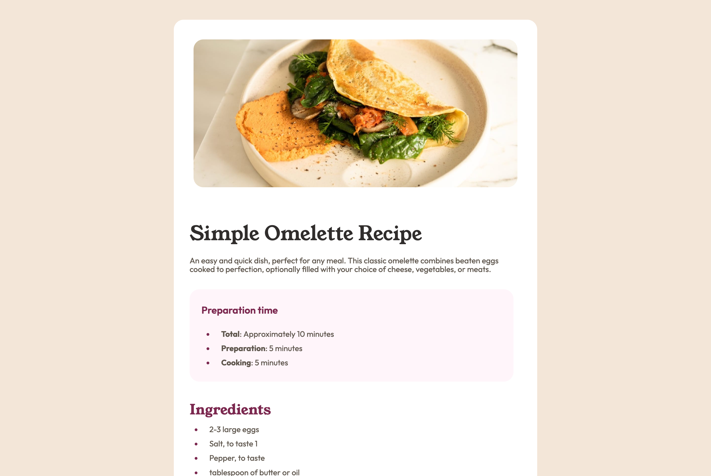

# Frontend Mentor - Recipe page solution

This is a solution to the [Recipe page challenge on Frontend Mentor](https://www.frontendmentor.io/challenges/recipe-page-KiTsR8QQKm). Frontend Mentor challenges help you improve your coding skills by building realistic projects.

## Table of contents

- [Overview](#overview)
  - [The challenge](#the-challenge)
  - [Screenshot](#screenshot)
  - [Links](#links)
- [My process](#my-process)
  - [Built with](#built-with)
  - [What I learned](#what-i-learned)
  - [Continued development](#continued-development)
  - [Useful resources](#useful-resources)
- [Author](#author)
- [Acknowledgments](#acknowledgments)

## Overview

### Screenshot

### Links

- Solution URL: [Add solution URL here](https://your-solution-url.com)
- Live Site URL: [Add live site URL here](https://your-live-site-url.com)

## My process

### Built with

- Semantic HTML5 markup
- CSS custom properties
- Flexbox
- Mobile-first workflow
- [React](https://reactjs.org/) - JS library

### What I learned

- I choose to use SASS to style recipe component since it allows me to practice and improve my knowledge of SASS

### Continued development

- How to effectively organize folder structure in SASS.
- Lessons on mixins and functions.

### Useful resources

- [Converting px to rem with Sass](https://notesontech.com/px-to-rem-with-sass/) - This helped me to understand how to write functions in SASS reason.
- [The New SASS Module System: Out with @import, In with @use](https://stefaniefluin.medium.com/the-new-sass-module-system-out-with-import-in-with-use-e1bd8ba032d0) - This is an amazing article which helped me finally understand how to use @use and @forward in SASS. I'd recommend it to anyone still learning this concept and what to practice.

## Author

- Frontend Mentor - [@mayor-creator](https://www.frontendmentor.io/profile/mayor-creator)
- Threads - [@mayor_creator](https://www.threads.net/@mayor_creator)

## Acknowledgments
